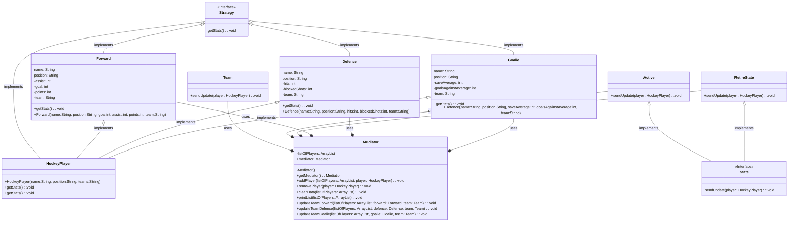
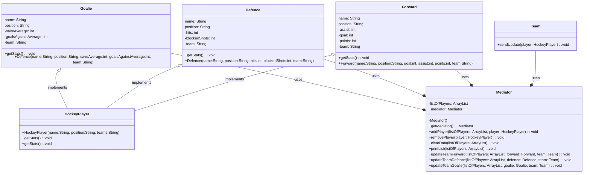

# CS665 Tomas Hornicek Final Project: Hockey League Database

Github link: https://github.com/metcs/met-cs665-assignment-project-thornicek

# Project structure

My project consists of one package, which includes 9 classes; Active, Defence, Forward, Goalie, HockeyPlayer, RetireState, and 2 interfaces; Strategy and State. The functionalities of each class and interface is explained at the top of each class/interface in the code. 

The project presentation resides in the final_project_sport_database.pdf file and the presentation notes are in the FinalProjectPresentationSpeakerNotes.docx file.

# UML Diagram 

# What are the design goals for the project?

For my final project, I have decided to simulate a hockey database. In my project the database is represented by an ArrayList and player objects, of different positions(with different properties), are entered into the database. The teams, that are in the league, are notified, each time a player enters or leaves the league. For my project I have used the Mediator pattern, Strategy pattern, Singleton pattern and State pattern. 

# How is the flexibility of my implementation?

In my opinion, my application is fairly flexible. This is mainly due to the fact that I have used the Factory design pattern. If my app would expand to include different sport leagues, the Factory pattern, which is implemented, could be expanded to include other sports too. 

# How is the simplicity and understandibility of your implementation?

In my opinion my application is simple and easy to understand. It has hockey player objects, that inherit from the HockeyPlayer abstract class. Then it has the State interface, that lets the teams know, when a change of players entering/leaving the league happens. Furthermore it has the Strategy interface, that is implemented, and changed based upon the object using it. The only change I would make, if I would be expanding the project, would be separating the classes into more than one package.

# How you avoided duplicate code?

By using inheritance, within the Factory pattern, I have avoided duplication, as all the hockey players, regardless their position, inherit attributes and methods from the parent HockeyPlayer class. I have also avoided duplication by assigning each hockey player object, with reusable methods that are overriden, with the Strategy pattern. The use of the Mediator design pattern also promotes codes reusability, as the Team class and the different player classes, only refer to the mediator object, and are not dependant on each other. This way it is easier to reuse these objects in other parts of the project. 

# Mediator Pattern

For my project I have decided to implement the Mediator design pattern. The Mediator design pattern reduces coupling between the components of a program by making them communicate indirectly, through a mediator object. In my application case it was the communication between the different HockeyPlayer child classes and the Team class. For the purpose of my application I wanted them to be separated because the teams in the league should not know how the transactions happen in the league or of the transcations of other teams in the league, they just need to know if they happened. If I was to expand on this project, the mediator object makes it easier to modify, extend and reuse individual components, as they are no longer dependant on a lot of classes.

# Mediator UML Diagram

The UML diagram below is a respresentation of my implementation of the Mediator pattern.

